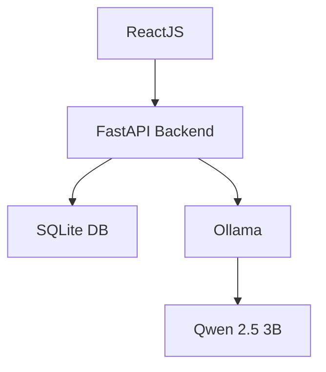

<div align="center">

# 📄 CV Filtering & Evaluation System (Local AI)

### 🔒 Privacy-First Recruitment Platform – Qwen 2.5 (3B) via Ollama

<p>
Hệ thống phân tích & đánh giá CV chạy local bằng Python, đảm bảo bảo mật dữ liệu tuyệt đối
</p>


</div>

---

## 📌 Overview

**CV Filtering & Evaluation System (Local AI)** là nền tảng tuyển dụng thông minh với điểm khác biệt:

> 🔒 **100% xử lý local (offline)**
> 🚫 **Không phụ thuộc API bên thứ 3**

Hệ thống sử dụng **Python + FastAPI + SQLite** kết hợp **Ollama chạy model Qwen 2.5 (3B)** để:

* Phân tích CV tự động
* So khớp với Job Description
* Chấm điểm ứng viên
* Bảo mật dữ liệu tuyệt đối

---

## 🚀 Key Features

### 🔒 Privacy-First (Offline 100%)

* Không gửi dữ liệu ra internet
* Xử lý hoàn toàn nội bộ
* Phù hợp môi trường doanh nghiệp bảo mật cao

---

### 📄 Smart CV Parser

* Hỗ trợ:

  * PDF, DOCX
* Trích xuất:

  * 👤 Thông tin cá nhân
  * 🎓 Học vấn
  * 💼 Kinh nghiệm
  * 🛠 Kỹ năng

---

### 🎯 AI Scoring & Evaluation

* So sánh:

  * CV vs JD
* Trả về:

  * 📊 Match Score (%)
  * 📝 Nhận xét
  * 📌 Phân loại ứng viên

---

### ⚡ Batch Processing

* Upload nhiều CV
* Xử lý async (background tasks)
* Không block UI

---

### 📊 Dashboard

* Danh sách ứng viên
* Lọc theo:

  * Điểm
  * Trạng thái
* Xem chi tiết


---

## 🧱 Tech Stack

### 🔹 Architecture



---

### 🔹 Frontend

```text id="n3y8ak"
React 18+
Axios
TailwindCSS
```

---

### 🔹 Backend

```text id="x2r6mn"
Python (FastAPI)
Uvicorn
Pydantic
Background Tasks
```

---

### 🔹 Database

```text id="f5l9sd"
SQLite (file-based, lightweight)
```

---

### 🔹 AI Engine

```text id="b8q4hv"
Ollama
Model: Qwen 2.5 - 3B
```

---

## ⚙️ System Requirements

```bash id="u6p2wq"
Node.js >= 18
Python >= 3.9
pip / virtualenv
SQLite (built-in)
Ollama
RAM >= 8GB (khuyến nghị 16GB)
```

---

## 📥 Installation Guide

---

### 1️⃣ Setup AI Engine (Ollama)

```bash id="j4m9ts"
# Install Ollama và chạy model
ollama run qwen2.5:3b
```

---

### 2️⃣ Clone Project

```bash id="z9x1rf"
git clone https://github.com/your-username/cv-filtering-local-ai.git
cd cv-filtering-local-ai
```

---

### 3️⃣ Backend Setup (FastAPI + SQLite)

```bash id="p3k8dw"
cd backend

# Tạo virtual environment
python -m venv venv
source venv/bin/activate   # Linux/Mac
venv\Scripts\activate      # Windows

# Install dependencies
pip install -r requirements.txt

# Tạo database SQLite
touch database.db   # Linux/Mac
type nul > database.db   # Windows

# Run migration (nếu dùng Alembic)
alembic upgrade head

# Run server
uvicorn main:app --reload
```

---

### 4️⃣ Frontend Setup

```bash id="y7s4hf"
cd frontend
npm install
npm run dev
```

---

## 🧠 AI Processing Flow

1. Upload CV
2. Parse nội dung
3. Gửi prompt → Ollama
4. Model Qwen xử lý
5. Lưu SQLite DB
6. Hiển thị kết quả

---

## 🔐 Security & Privacy

* ✅ Offline 100%
* ✅ Không leak dữ liệu
* ✅ Bảo mật CV ứng viên
* ✅ Không phụ thuộc bên thứ 3

---

## 🤝 Contributing

```bash id="d5v2lk"
git clone your-fork-url

pip install -r requirements.txt
npm install

uvicorn main:app --reload
npm run dev
```

---

## 📄 License

MIT License

---

## 👨‍💻 Contact

* 👤 Developer: **Đỗ Thành Nhân**
* 📧 Email: **[dothanhnhan1024@gmail.com](mailto:dothanhnhan1024@gmail.com)**
* 📱 Hotline: +84 386 356 750

---

<div align="center">

⭐ **If you find this project useful, give it a star!** ⭐

</div>
